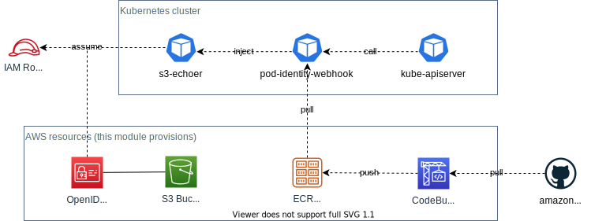

# terraform-aws-kubernetes-irsa [](https://circleci.com/gh/int128/terraform-aws-kubernetes-irsa)

This is a Terraform module for IAM Roles for Service Accounts (IRSA) on a self-hosted Kubernetes cluster.
It supports [kops](https://github.com/kubernetes/kops) clusters.


## Getting Started

This is based on [the self-hosted Kubernetes setup of pod-identity-webhook](https://github.com/aws/amazon-eks-pod-identity-webhook/blob/master/SELF_HOSTED_SETUP.md).

### 1. Generate a key pair

Generate a key pair and jwks document.

```sh
mkdir -p irsa
cd irsa

ssh-keygen -t rsa -b 2048 -f sa-signer.key -m pem
ssh-keygen -e -m PKCS8 -f sa-signer.key.pub > sa-signer-pkcs8.pub

go run /amazon-eks-pod-identity-webhook/hack/self-hosted/main.go -key sa-signer-pkcs8.pub | jq '.keys += [.keys[0]] | .keys[1].kid = ""' > jwks.json
```

It will create the following files:

- `./irsa/sa-signer.key`
- `./irsa/sa-signer-pkcs8.pub`
- `./irsa/jwks.json`

### 2. Provision the AWS resources

Run Terraform with the following file.

```tf
resource "random_uuid" "irsa_s3_bucket_name" {
}

module "irsa" {
  source              = "int128/kubernetes-irsa/aws"
  oidc_s3_bucket_name = "oidc-${random_uuid.irsa_s3_bucket_name.result}"
  oidc_jwks_filename  = "./irsa/keys.json"
}

output "irsa_oidc_issuer" {
  description = "Issuer of OIDC provider for IRSA"
  value       = module.irsa.oidc_issuer
}

output "irsa_pod_identity_webhook_ecr_repository_url" {
  description = "URL to the ECR repository for eks/pod-identity-webhook"
  value       = module.irsa.pod_identity_webhook_ecr_repository_url
}
```

It will create the following resources:

- S3 bucket for OpenID Connect discovery endpoint
- OpenID Connect provider (IAM)
- ECR repository to store the image of pod-identity-webhook
- CodeBuild project to build the image of pod-identity-webhook

See also the diagram.



You will get the following outputs.

```console
% terraform output
irsa_oidc_issuer = https://oidc-RANDOM.s3.amazonaws.com
irsa_pod_identity_webhook_ecr_repository_url = REGISTRY_ID.dkr.ecr.REGION.amazonaws.com/eks/pod-identity-webhook
```

### 3. Configure the Kubernetes cluster

Set the following API server flags.

```
--service-account-key-file=sa-signer-pkcs8.pub
--service-account-signing-key-file=sa-signer.key
--api-audiences=sts.amazonaws.com
--service-account-issuer=https://oidc-RANDOM.s3.amazonaws.com
```

#### For kops users

If you are using kops, you can generate a template of the cluster config.

```tf
module "irsa" {
  signer_public_key_filename  = "./irsa/sa-signer-pkcs8.pub"
  signer_private_key_filename = "./irsa/sa-signer.key"
}

resource "local_file" "irsa_kops_cluster_yaml" {
  filename = "./irsa/kops.yaml"
  content  = module.irsa.kops_cluster_yaml
}
```

You will get `irsa/kops.yaml` after applying.

```sh
# get the template
terraform apply
less irsa/kops.yaml

# apply the cluster config
kops edit cluster
kops update cluster
kops rolling-update cluster
```

### 4. Deploy pod-identity-webhook

You can build and push the Docker image of [pod-identity-webhook](https://github.com/aws/amazon-eks-pod-identity-webhook) to the ECR repository using the CodeBuild project.

1. Open the CodeBuild project.
1. Start a build.
1. Make sure the image exists on the ECR repository.

To deploy the manifest of pod-identity-webhook to the Kubernetes cluster:

```console
cd /amazon-eks-pod-identity-webhook
make cluster-up IMAGE=REGISTRY_ID.dkr.ecr.REGION.amazonaws.com/eks/pod-identity-webhook
```

### 5. Verify a service account

Create an IAM role.

```tf
resource "aws_iam_role" "s3-echoer" {
  name               = "s3-echoer"
  assume_role_policy = <<EOF
{
  "Version": "2012-10-17",
  "Statement": [
    {
      "Effect": "Allow",
      "Principal": {
        "Federated": "${module.irsa.oidc_provider_arn}"
      },
      "Action": "sts:AssumeRoleWithWebIdentity",
      "Condition": {
        "StringEquals": {
          "${module.irsa.oidc_issuer}:sub": "system:serviceaccount:default:s3-echoer"
        }
      }
    }
  ]
}
EOF
}

resource "aws_iam_role_policy_attachment" "s3-echoer" {
  role       = "${aws_iam_role.s3-echoer.name}"
  policy_arn = "arn:aws:iam::aws:policy/AmazonS3ReadOnlyAccess"
}
```

Create a service account annotated with the IAM role.

```sh
kubectl create sa s3-echoer
kubectl annotate sa s3-echoer eks.amazonaws.com/role-arn=arn:aws:iam::ACCOUNT_ID:role/s3-echoer
```

Run aws-cli and make sure you can see S3 buckets.

```sh
kubectl run aws -i --rm --image amazon/aws-cli --restart=Never --serviceaccount=s3-echoer -- s3 ls
```


## Contributions

This is an open source software. Feel free to open issues and pull requests.


<!--terraform-docs-->
## Requirements

No requirements.

## Providers

| Name | Version |
|------|---------|
| aws | n/a |

## Inputs

| Name | Description | Type | Default | Required |
|------|-------------|------|---------|:--------:|
| oidc\_ca\_sha1 | SHA1 thumbprint of the root CA certificate (default to \*.s3.amazonaws.com) | `string` | `"3fe05b486e3f0987130ba1d4ea0f299539a58243"` | no |
| oidc\_jwks\_filename | Filename of OIDC JWKS | `any` | n/a | yes |
| oidc\_s3\_bucket\_name | Name of a S3 bucket for the OIDC endpoint | `any` | n/a | yes |
| signer\_private\_key\_filename | Filename of the private key (for kops\_cluster.yaml) | `string` | `"/dev/null"` | no |
| signer\_public\_key\_filename | Filename of the private key (for kops\_cluster.yaml) | `string` | `"/dev/null"` | no |

## Outputs

| Name | Description |
|------|-------------|
| kops\_cluster\_yaml | Content of kops cluster.yaml |
| oidc\_issuer | Domain name of the S3 bucket (\*.s3.amazonaws.com) |
| oidc\_provider\_arn | ARN of the OIDC provider for IRSA |
| pod\_identity\_webhook\_ecr\_repository\_url | URL to the ECR repository for eks/pod-identity-webhook |

